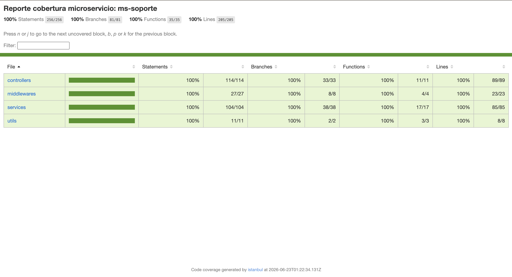

# MS-Soporte — Sanos y Salvos

Microservicio de soporte técnico de la plataforma **Sanos y Salvos**. Gestiona el ciclo completo de tickets de soporte, comentarios en hilo único y un chatbot con inteligencia artificial para responder preguntas frecuentes.

---

## Tecnologías

| Herramienta | Uso |
|---|---|
| Node.js + Express | Servidor HTTP |
| TypeScript | Tipado estático |
| PostgreSQL + TypeORM | Persistencia de tickets y comentarios |
| JWT (jsonwebtoken) | Verificación de tokens |
| Archivo JSON | Chatbot basado en reglas para preguntas frecuentes |
| Swagger (OpenAPI 3.0) | Documentación de endpoints |

---

## Arquitectura

### Patrón arquitectónico

- **MVC (Model-View-Controller)**: Adaptado para APIs REST (Model-Route-Controller-Service). Los *Controllers* gestionan las solicitudes y respuestas HTTP, las *Routes* definen los endpoints, y la lógica de negocio se centraliza en los *Services*. Los *Models* representan las entidades de la base de datos.

### Patrón de diseño

- **Repository Pattern**: Utilizado a través de TypeORM para abstraer la capa de acceso a datos. Los servicios se comunican con los repositorios para realizar operaciones sobre la base de datos (CRUD) sin acoplarse directamente a sentencias SQL.

---

## Estructura del proyecto

```
ms-soporte/
├── src/
│   ├── config/
│   │   ├── db.ts           # Conexión PostgreSQL + TypeORM
│   │   └── swagger.ts      # Configuración OpenAPI
│   ├── controllers/
│   │   ├── ticket.controller.ts
│   │   └── chatbot.controller.ts
│   ├── data/
│   │   └── chatbot-responses.json # Reglas del chatbot
│   ├── middlewares/
│   │   ├── errorHandler.ts
│   │   ├── notFound.ts
│   │   └── verifyToken.ts  # Verifica JWT + middleware soloAdmin
│   ├── models/
│   │   ├── Ticket.ts       # Entidad con estados y categorías
│   │   └── Comentario.ts   # Hilo de comentarios por ticket
│   ├── routes/
│   │   ├── ticket.routes.ts
│   │   └── chatbot.routes.ts
│   ├── services/
│   │   ├── ticket.service.ts
│   │   └── chatbot.service.ts
│   ├── utils/
│   │   ├── email.ts        # Configuración para el envío de correos
│   │   └── response.ts
│   ├── app.ts
│   └── server.ts
├── tests/                  # Pruebas unitarias
├── Dockerfile              # Configuración de contenedor
├── docker-compose.yml      # Servicios Docker (App + DB)
├── package.json
├── .env
├── .env.example
├── .gitignore
└── README.md
```
---

## Levantar el servidor

```bash
# Desarrollo
npm run dev

# Producción
npm run build
npm start
```

---

## Documentación Swagger

```
http://localhost:3003/api/docs
```

---

## Endpoints

### Tickets

| Método | Ruta | Descripción | Rol |
|---|---|---|---|
| POST | `/api/tickets/publico` | Crear ticket público (sin autenticación) | Público |
| POST | `/api/tickets` | Crear ticket | Usuario |
| GET | `/api/tickets/mis-tickets` | Ver mis tickets | Usuario |
| GET | `/api/tickets/:id`| Ver ticket por ID | Usuario |
| POST | `/api/tickets/:id/comentarios` | Añadir comentario | Usuario |
| GET | `/api/tickets` | Listar todos los tickets | Administrador |
| PATCH | `/api/tickets/:id/asignar` | Tomar/asignar ticket | Administrador |
| POST | `/api/tickets/:id/responder` | Responder ticket | Administrador |
| PATCH | `/api/tickets/:id/estado` | Actualizar estado | Administrador |

### Chatbot

| Método | Ruta | Descripción |
|---|---|---|
| POST | `/api/chatbot/preguntar` | Consultar al chatbot |

---

## Pruebas en Postman

### Prueba 0 — Crear ticket público (sin autenticación)
```
POST http://localhost:3003/api/tickets/publico
```
Body:
```json
{
    "email": "ciudadano@ejemplo.com",
    "categoria": "problema_tecnico",
    "asunto": "Problema con luminaria",
    "descripcion": "Hay una luminaria apagada en la calle 5."
}
```
Respuesta esperada:
```json
{
    "ok": true,
    "data": {
        "id": "uuid-generado",
        "email_contacto": "ciudadano@ejemplo.com",
        "categoria": "problema_tecnico",
        "asunto": "Problema con luminaria",
        "descripcion": "Hay una luminaria apagada en la calle 5.",
        "estado": "abierto",
        "asignado_a": null,
        "created_at": "...",
        "updated_at": "..."
    }
}
```

---

### Prueba 1 — Crear ticket (RF-40)
```
POST http://localhost:3003/api/tickets
Authorization: Bearer <accessToken>
```
Body:
```json
{
    "categoria": "problema_tecnico",
    "asunto": "No puedo subir fotos",
    "descripcion": "Al intentar subir una foto me aparece error 500"
}
```
Respuesta esperada:
```json
{
    "ok": true,
    "data": {
        "id": "uuid-generado",
        "user_id": "uuid-del-usuario",
        "categoria": "problema_tecnico",
        "asunto": "No puedo subir fotos",
        "descripcion": "Al intentar subir una foto me aparece error 500",
        "estado": "abierto",
        "asignado_a": null,
        "created_at": "...",
        "updated_at": "..."
    }
}
```

---

### Prueba 2 — Ver mis tickets (RF-41)
```
GET http://localhost:3003/api/tickets/mis-tickets
Authorization: Bearer <accessToken>
```

---

### Prueba 3 — Añadir comentario (RF-42)
```
POST http://localhost:3003/api/tickets/:id/comentarios
Authorization: Bearer <accessToken>
```
Body:
```json
{
    "contenido": "Adjunto captura del error que me aparece"
}
```

---

### Prueba 4 — Listar todos los tickets (RF-43) — solo administrador
```
GET http://localhost:3003/api/tickets
Authorization: Bearer <accessToken-administrador>
```

Filtrar por estado:
```
GET http://localhost:3003/api/tickets?estado=abierto
```

---

### Prueba 5 — Tomar ticket (RF-44) — solo administrador
```
PATCH http://localhost:3003/api/tickets/:id/asignar
Authorization: Bearer <accessToken-administrador>
```

---

### Prueba 6 — Responder ticket (RF-45) — solo administrador
```
POST http://localhost:3003/api/tickets/:id/responder
Authorization: Bearer <accessToken-administrador>
```
Body:
```json
{
    "contenido": "Hemos revisado el problema y lo solucionaremos en 24 horas"
}
```

---

### Prueba 7 — Actualizar estado (RF-46) — solo administrador
```
PATCH http://localhost:3003/api/tickets/:id/estado
Authorization: Bearer <accessToken-administrador>
```
Body:
```json
{
    "estado": "resuelto"
}
```
Estados válidos: `abierto`, `en_proceso`, `resuelto`, `cerrado`

---

### Prueba 8 — Chatbot (RF-47)
```
POST http://localhost:3003/api/chatbot/preguntar
```
Body:
```json
{
    "pregunta": "¿Cómo puedo crear un ticket de soporte?"
}
```
Respuesta esperada:
```json
{
    "ok": true,
    "data": {
        "respuesta": "Si estás experimentando problemas técnicos, por favor crea un ticket de soporte detallando el error y nuestro equipo te ayudará a la brevedad."
    }
}
```

---

## Modelo de datos

### Estados del ticket

| Estado | Descripción |
|---|---|
| `abierto` | Ticket recién creado, sin atender |
| `en_proceso` | Ticket tomado por un administrador |
| `resuelto` | Problema solucionado |
| `cerrado` | Ticket finalizado, no acepta más comentarios |

### Categorías del ticket

| Categoría | Descripción |
|---|---|
| `problema_tecnico` | Fallas o errores en la plataforma |
| `reporte_abuso` | Comportamiento indebido de usuarios |
| `otro` | Cualquier otra consulta |

### Comentarios

El hilo de comentarios es único por ticket. Cada comentario identifica quién lo escribió mediante `tipo_autor`:
- `usuario` — comentario del ciudadano que abrió el ticket
- `administrador` — respuesta del equipo de soporte

---

## Pruebas Unitarias

El proyecto cuenta con una suite de pruebas unitarias para garantizar la calidad y el correcto funcionamiento de los servicios.

**Ejecutar las pruebas:**
```bash
npm run test
```

**Generar reporte de cobertura:**
```bash
npm run test:coverage
```

Para visualizar el reporte de cobertura detallado, abre el archivo generado en tu navegador:
```bash
open coverage/index.html
```

**Reporte de cobertura test microservicio:**

 